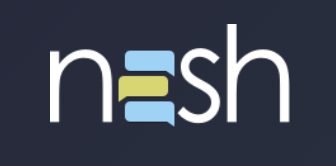
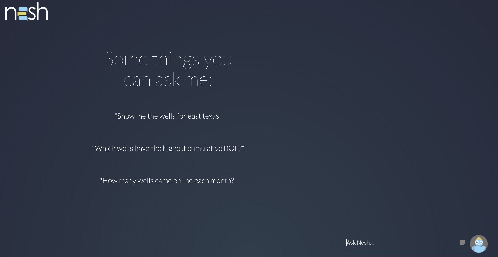
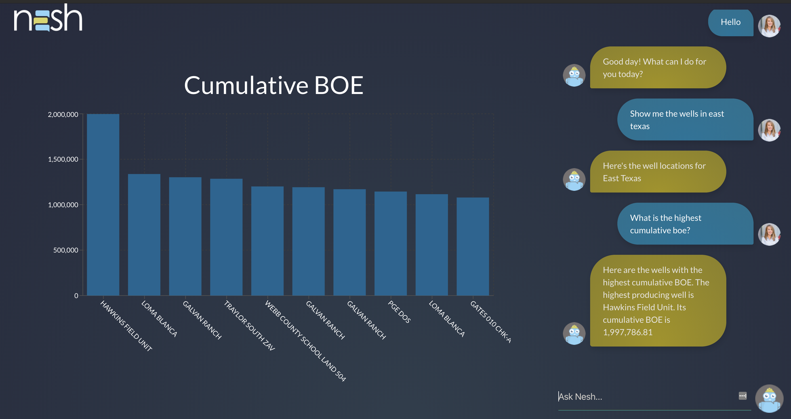
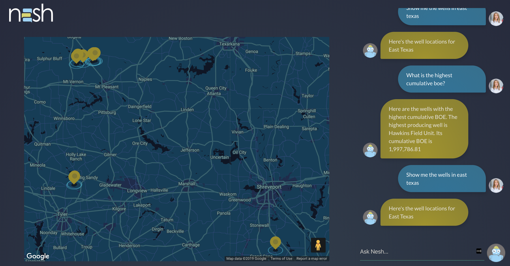

<h1>Hello Nesh</h1>

<h2>About Nesh</h2>

<b>Nesh's purpose:</b> Nesh is a company based out of Houston, TX with the goal of creating a chatbot to assist Oil and Gas companines obtain information and data in a more efficient and quick manner. Our team partnered with Nesh to offer another solution to assist them with their ultimate goal.  

<b>Nesh's Features:</b> Our team created a Nesh using Google Dialogflow which allows users to have a natural converstaion when asking questions in regards to drilling info, well data, etc. The chatbot runs off a Raspberry Pi 4B, takes in a user's question, and displays the answer through our front-end React app. The data is queried from a PostgreSQL database, and is sent to the front-end using a Google Dialogflow webhook. 

<b>Some questions to ask Nesh:</b>    
"Show me the wells in the East Texas Basin." 
"Which wells have the highest cumulative BOE?" 
"How many wells came online last month?"

  

 

 

 

<h2>Database</h2>
The database used for this project was PostregSQL using Sequelize. 

<h2>Programs, Hardware, and API</h2>
Google Dialogflow, JavaScript, Node.js, React, Redux, CSS, Raspberry Pi 4B, Google Maps API, and Recharts.

<h2>Team Members</h2> 
<a href='https://github.com/taliaa10'>Taliaa Tauatolo</a>, <a href='https://github.com/Umreen24'>Umreen Imam</a>, <a href='https://github.com/kristiperez'>Kristi Perez</a>, <a href='https://github.com/Jacob-Bankston'>Jacob Bankston</a>, <a href='https://github.com/nickfuentes'>Nickolas Fuentes</a>
